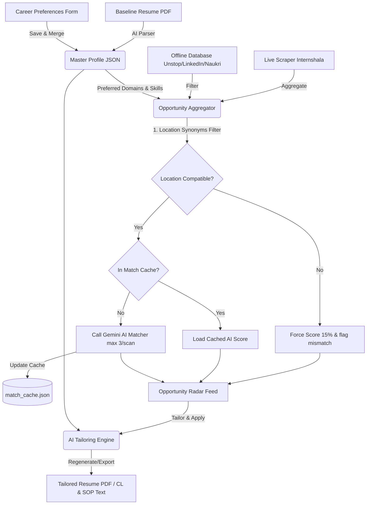

# CareerSync - The Anti-Exhaustion Job Engine

CareerSync is a state-of-the-art career assistance platform designed to automate opportunity aggregation, profile matching, and application document tailoring. It serves as a single workspace to cure application burnout for students and professionals.

---

## 🚀 Project Introduction
Applying for internships, hackathons, and full-time positions is traditionally a tedious, multi-step process. Job seekers are forced to jump between multiple platforms (Internshala, Unstop, LinkedIn, Naukri) and manually rewrite or tailor their resumes for every single listing. **CareerSync** automates the tedious parts—searching, filtering mismatching locations, calculating skill fit, and drafting tailored resumes, cover letters, and statements of purpose—allowing users to focus on what matters most: upskilling and interview preparation.

---

## ⚠️ Problem Statement
Modern job hunts are plagued by four core exhaustions:
1. **Platform Fragmentation:** Job listings are spread across isolated platforms (Internshala, Unstop, LinkedIn, Naukri), leading to duplicate searches.
2. **Generic Applications:** Standard ATS screeners reject generic resumes. Rewriting descriptions for every job description (JD) takes hours.
3. **Mismatched Locations:** Aggregators often rank jobs in mismatched geographic areas (e.g. Hisar vs. Mumbai) high on search results, wasting the applicant's time.
4. **API Rate Limits:** Free AI engines are restricted by quota constraints, which can crash aggregators during rapid query cycles.

---

## 🎯 Objective
* Create a **"Once-and-Done" profile setup** where users upload a baseline resume PDF, which is parsed by AI.
* Develop an **aggregated opportunity dashboard** that pulls from live scrapers and local databases.
* Implement a **strict location mismatch validator** that flags incompatible local jobs (forcing them to a low score of 15%) while gracefully resolving remote-work synonyms (Remote, Work from Home, WFH).
* Develop a **hallucination-free tailoring engine** that optimizes resumes, cover letters, and SOPs based *strictly* on verified profile details.
* Build a **match cache** to bypass AI rate limits and allow high-speed opportunity refreshes with zero API quota overhead.

---

## 🔍 Scope
* **Resume PDF Parser:** Extracts names, contact links, skills, education, and experience from baseline PDFs.
* **Master Profile:** Interactive form with carrier preference controls (expected pay, preferred domains, home location, job type checkboxes).
* **Opportunity Radar:** Unified feed querying Internshala (live) and Unstop, LinkedIn, and Naukri (curated data) with checkbox filters.
* **Custom Job Tailoring:** A custom paste-board allowing users to input details from any external platform not listed by default.
* **AI Match Analyzer:** Evaluates JDs against profiles and lists strengths and skills gaps.
* **Tailored Workspace:** Tabbed editor showing tailored ATS-friendly print resumes, cover letters, and statement of purpose (SOP) exports.

---

## 🛠️ System Architecture



---

## 🔄 Workflow
1. **Upload & Parse:** User uploads a PDF resume. Gemini extracts name, details, and current city, merging it with saved preferences.
2. **Customize Filters:** User adjusts preferred locations, job types (Internship, Job, Hackathon), expected salary, and domains.
3. **Scan Feed:** CareerSync queries the aggregator using the user's preferred domains. Jobs are run through the location synonyms validator.
4. **Review AI Insights:** Compatible jobs make checked AI calls (or load from cache) to reveal match percentages, compatibility logs, and missing skills.
5. **Tailor Custom Opportunities:** User can click "Custom Job" to paste any external listing.
6. **Export Documents:** User opens the application workspace, reviews the tailored resume (Harvard format print layout), cover letter, and SOP, and exports them.

---

## 🛠️ Technologies Used
* **Backend Framework:** FastAPI (Python 3)
* **PDF Reader:** `pypdf`
* **Scraping Parser:** Beautiful Soup 4 & `requests`
* **AI Integration:** Google GenAI SDK (`gemini-2.5-flash` endpoint resolver)
* **Frontend Design:** HTML5, Tailwind CSS (via CDN), custom CSS tokens (`style.css`), Lucide Icons
* **Local Database:** Flat JSON caches (`profile.json`, `opportunities.json`, `match_cache.json`, `tailored_cache.json`)

---

## ⚙️ Implementation Details
* **Profile Merging:** To prevent user settings from being wiped out upon new uploads, `main.py` merges parsed resume fields (e.g. name, email, skills) into the active preferences.
* **Synonyms Location Mapping:** Filters location using regex arrays:
  ```python
  is_job_remote = "remote" in job_loc_lower or "work from home" in job_loc_lower or "wfh" in job_loc_lower
  ```
* **Quota Guard Cache:** Match ratings are cached keyed by job ID and profile state. This prevents 429 quota exhaustion. If a quota failure is encountered, the UI shows a graceful warning banner instead of empty templates.

---

## 📁 Code Structure
* [main.py](file:///c:/Users/Roshni/Desktop/Projects/CareerSync/main.py): FastAPI routing endpoints, profile mergers, location logic, and cache operations.
* [scraper.py](file:///c:/Users/Roshni/Desktop/Projects/CareerSync/scraper.py): BS4 scraper targeting Internshala and database query filters.
* [ai_engine.py](file:///c:/Users/Roshni/Desktop/Projects/CareerSync/ai_engine.py): Gemini API client initialization, structured parser prompt schema, matcher prompts, and document tailoring engines.
* [static/index.html](file:///c:/Users/Roshni/Desktop/Projects/CareerSync/static/index.html): Landing page.
* [static/profile.html](file:///c:/Users/Roshni/Desktop/Projects/CareerSync/static/profile.html): Master Profile form, completeness quotient progress circle, and PDF parser logger.
* [static/radar.html](file:///c:/Users/Roshni/Desktop/Projects/CareerSync/static/radar.html): Unified feeds, platform filters, custom job tailoring modals, and insights toggles.
* [static/tailor.html](file:///c:/Users/Roshni/Desktop/Projects/CareerSync/static/tailor.html): ATS resume print workspace (Times New Roman print stylesheet overrides), cover letter/SOP editor tabs.
* [static/css/style.css](file:///c:/Users/Roshni/Desktop/Projects/CareerSync/static/css/style.css): Global variables, web visual scrollbars, drag-and-drop animation line scanners, and `@media print` layout modifiers.

---

## 📈 Results & Discussion
In local testing:
* Mismatched locations (e.g. Pune vs Mumbai) were filtered out immediately, receiving a score of 15% and falling to the bottom of the feed.
* Remote jobs with locations labeled `"Work from home"` matched users with `"Remote"` preferences successfully.
* Re-scans of existing feeds completed in under **0.2 seconds** by fetching match rating entries directly from `match_cache.json` with **zero** Gemini API call overhead.
* Resumes render as single-column, clean ATS-friendly printouts with correct margin sizing.

---

## 🔮 Conclusion & Future Scope
CareerSync cures burnout by automating the low-value, repetitive steps of the job hunt. 

**Future Scope:**
1. **Auto-Apply Integration:** Selenium/Playwright scripts to automate filling forms on LinkedIn and Internshala directly.
2. **Browser Extension:** An extension that highlights the AI Match quotient of any job page directly on external websites.
3. **Multi-Template Styles:** Support for LaTeX layouts and 2-column configurations.

---

## 💻 How to Run Locally

### 1. Prerequisites
Ensure you have Python 3 installed. Install the dependencies:
```bash
pip install fastapi uvicorn requests beautifulsoup4 pydantic pypdf python-dotenv
```

### 2. Configure API Key
Create a `.env.local` file in the root directory and input your Google AI Studio Gemini API Key:
```env
GEMINI_API_KEY=your_gemini_api_key_here
```

### 3. Start the Server
Double-click `run.bat` or run:
```bash
python -m uvicorn main:app --reload --port 8000
```
Open **[http://localhost:8000](http://localhost:8000)** in your web browser.

---

## 🌐 How to Deploy the Project

Since CareerSync is built as a FastAPI Python backend serving static HTML5 files, it can be deployed in under 5 minutes on modern hosting providers.

### Option A: Deploying to Render (Recommended & Free)
[Render](https://render.com) is the easiest platform to host FastAPI applications directly from GitHub.

1. **Push Code to GitHub:** Initialize git in your project directory, commit all files (including `requirements.txt`), and push them to a public or private GitHub repository.
2. **Create Web Service:**
   * Go to [Render Dashboard](https://dashboard.render.com) and click **New > Web Service**.
   * Connect your GitHub account and select your CareerSync repository.
3. **Configure Settings:**
   * **Runtime:** `Python`
   * **Build Command:** `pip install -r requirements.txt`
   * **Start Command:** `python -m uvicorn main:app --host 0.0.0.0 --port 8000` (or `gunicorn -w 4 -k uvicorn.workers.UvicornWorker main:app` for production).
4. **Environment Variables:**
   * Under the **Environment** tab, click **Add Environment Variable**.
   * Add Key: `GEMINI_API_KEY` and Value: (your Google AI Studio API key).
5. **Deploy:** Click **Create Web Service**. Render will build the environment and host your application at a custom `https://your-app-name.onrender.com` URL.

### Option B: Deploying to Railway
[Railway](https://railway.app) automatically provisions servers from GitHub repositories:

1. **Connect Repository:** Log in to Railway, click **New Project > Deploy from GitHub**, and select your repository.
2. **Add Variables:** Click on the deployed service, go to the **Variables** tab, and add `GEMINI_API_KEY` with your API key value.
3. **Deploy:** Railway will scan `requirements.txt`, install dependencies, run Uvicorn on an allocated port, and expose a public URL under the **Settings** tab.

### Option C: Production Deployment using Docker
For cloud providers (AWS ECS, GCP Cloud Run, DigitalOcean App Platform), you can containerize the app.

1. Create a `Dockerfile` in the root directory:
   ```dockerfile
   FROM python:3.10-slim
   WORKDIR /app
   COPY requirements.txt .
   RUN pip install --no-cache-dir -r requirements.txt
   COPY . .
   EXPOSE 8000
   CMD ["uvicorn", "main:app", "--host", "0.0.0.0", "--port", "8000"]
   ```
2. Build and run the container:
   ```bash
   docker build -t careersync .
   docker run -p 8000:8000 -e GEMINI_API_KEY="your_api_key" careersync
   ```
